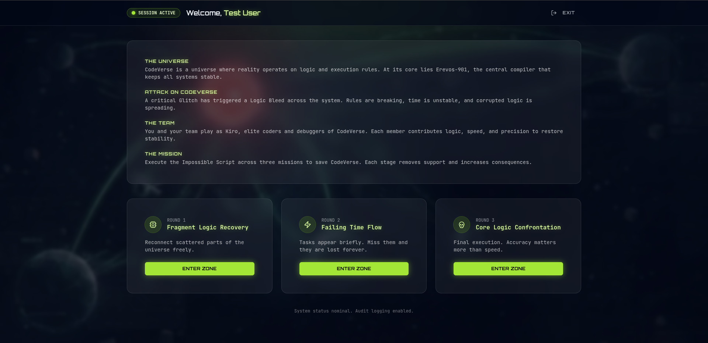
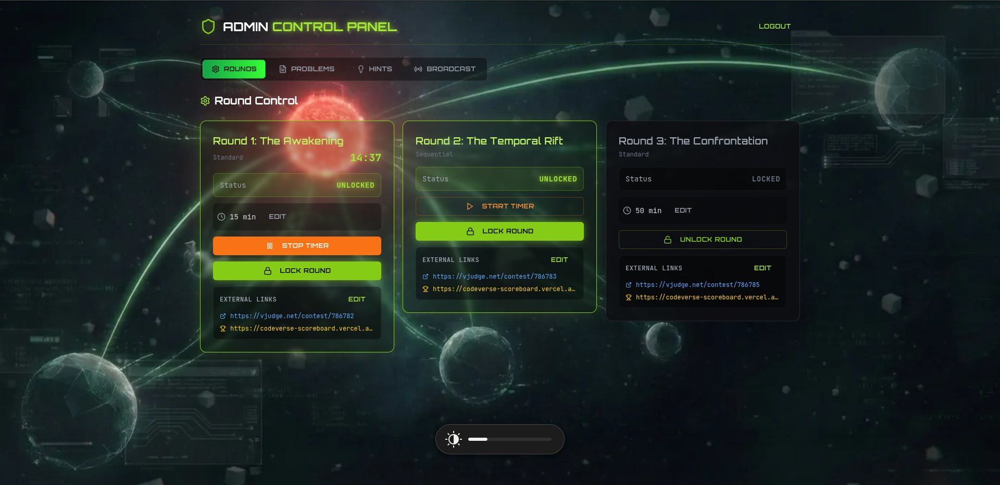

<div align="center">

# </> CodeVerse CodeSprint

### Competitive Programming Platform — Procom'26

A real-time, multi-round competitive programming platform built for the **CodeVerse CodeSprint** competition at **Procom'26**. Teams log in, tackle algorithmic challenges across three themed rounds, and submit solutions on [VJudge](https://vjudge.net/). Live scoreboard at **[codeverse-scoreboard.vercel.app](https://codeverse-scoreboard.vercel.app/)**.

[Features](#-features) · [Architecture](#-architecture) · [Setup](#-setup) · [Admin Guide](#-admin-panel) · [Database](#-database-schema)

</div>

---

## 📋 Overview

CodeVerse CodeSprint is a browser-based problem statement delivery platform designed for on-site competitive programming competitions. It handles:

- **Problem delivery** with rich HTML statements (tables, code blocks, math)
- **Three distinct round formats** with different rules and constraints
- **Real-time admin control** — unlock rounds, start/stop timers, and broadcast messages
- **Server-authoritative timers** with clock-sync to prevent client manipulation
- **Database-level content masking** for Round 2's sequential problem reveal

> **Note:** Submissions and judging are handled externally via VJudge. This platform exclusively manages problem display, round control, hints, and team sessions.

---

## Platform Preview

<div align="center">

### Team Dashboard



<sub>The mission selection interface. Teams start here to learn about the CodeVerse storyline and choose their next challenge.</sub>

<br/><br/>

### Round 2 — Sequential Timer Challenge


<sub>Our sequential challenge round. Problems are revealed one by one with strict time limits, ensuring every team stays synchronized.</sub>

<br/><br/>

### Admin Control Panel



<sub>The central control panel for administrators. From here, you can manage round access, monitor timers, and oversee the entire competition in real-time.</sub>

</div>

---

## ✨ Features

### Competition Rounds

|    Round    | Name                      | Format     | Details                                                                                                                               |
| :---------: | ------------------------- | ---------- | ------------------------------------------------------------------------------------------------------------------------------------- |
| **1** | Fragmented Logic Recovery | Standard   | All problems visible at once. Hints unlock progressively based on elapsed time.                                                       |
| **2** | Failing Time Flow         | Sequential | Problems revealed one at a time on a 10-minute window each. Auto-advances when time expires. Content masked at DB level until unlock. |
| **3** | Core Logic Confrontation  | Standard   | All problems visible. No hints. Tougher questions with penalties.                                                                    |

### Authentication & Security

- **Team Auth** — Custom bcrypt-based authentication via PostgreSQL RPC (`pgcrypto`). No Supabase Auth accounts needed per team — scales to 100+ teams effortlessly.
- **Admin Auth** — Supabase Auth with email/password. Whitelisted admin emails only.
- **Row Level Security (RLS)** — All tables enforce RLS. Public users get read-only access to unlocked content; write operations require authenticated admin role.
- **Session Isolation** — Team sessions stored in `sessionStorage` (tab-scoped), preventing cross-tab session leaks.
- **Inactivity Timeout** — Sessions auto-expire after 20 minutes of inactivity.

### Round 2 Content Masking

Round 2 problems are protected at the **database level**, not just the client:

1. A PostgreSQL function `is_problem_visible()` calculates whether a problem should be revealed based on elapsed round time
2. A `problems_masked` database view replaces statement content with a placeholder for unrevealed problems
3. Non-admin clients query the masked view — even intercepting API calls reveals nothing
4. Hints for masked problems are also blocked via RLS policies

### Real-Time Features (Supabase Realtime)

- **Round state changes** — Lock/unlock, timer start/stop propagate instantly to all connected clients
- **Broadcasts** — Admin announcements appear as banners + toast notifications within seconds
- **Problem updates** — Admin edits to problems and hints reflect in real-time
- **Visibility-aware connections** — Realtime channels disconnect after 10 min of tab inactivity to conserve resources

### Timer System

- **Server as source of truth** — `start_round_timer` RPC uses PostgreSQL `NOW()`, not client timestamps
- **Clock synchronization** — Clients measure server-client offset via `get_server_time()` RPC with latency compensation
- **Periodic re-sync** — Every 2 minutes, drift > 1 second triggers correction
- **No client-side timer stop** — Clients never write `timer_active = false`, preventing clock manipulation exploits

### Hints

- Per-problem, time-gated hints configured via `unlock_after_minutes`
- Unlock relative to round timer start (e.g., hint unlocks 10 min into the round)
- Available in Rounds 1 & 3; disabled for Round 3 by competition rules
- Managed through admin panel with full CRUD

### Broadcasts

- Admin sends typed messages: `info` | `warning` | `success` | `error`
- Appear as color-coded banners at top of participant screens
- Auto-dismiss after 30 seconds
- Real-time delivery via Supabase Postgres Changes subscription

### Activity Tracking

- Tracks `mousemove`, `keydown`, `scroll`, `click`, `touchstart` events (debounced at 30s intervals)
- Updates session activity timestamp to prevent premature timeout
- Integrated into all round pages

---

## 🏗 Architecture

### Tech Stack

| Layer                | Technology                                      |
| -------------------- | ----------------------------------------------- |
| **Frontend**   | React 18 + TypeScript                           |
| **Build**      | Vite (with SWC)                                 |
| **Styling**    | Tailwind CSS + Radix UI + Framer Motion         |
| **State**      | TanStack React Query                            |
| **Backend**    | Supabase (PostgreSQL + Auth + Realtime)         |
| **Deployment** | Vercel                                          |
| **Fonts**      | Orbitron (display) + JetBrains Mono (body/code) |

### Project Structure

```
├── public/                    # Static assets
├── scripts/
│   ├── import-teams.js        # CSV → Supabase team import script
│   └── teams.csv              # Team data (name, username, password)
├── src/
│   ├── components/
│   │   ├── Admin/             # Admin panel tabs (RoundControl, ProblemEditor, HintManager, BroadcastPanel)
│   │   ├── ui/                # Radix/shadcn component library
│   │   ├── BroadcastBanner.tsx # Participant-facing broadcast display
│   │   └── CosmicBackground.tsx
│   ├── hooks/
│   │   ├── useTeamSession.tsx  # Team auth + session management
│   │   ├── useRounds.tsx       # Round data + realtime subscriptions
│   │   ├── useProblems.tsx     # Problem queries (masked vs full)
│   │   ├── useHints.tsx        # Hint queries + realtime
│   │   ├── useBroadcasts.tsx   # Broadcast queries + realtime
│   │   ├── useServerTime.tsx   # Clock sync + server time offset
│   │   └── useActivityTracker.tsx
│   ├── integrations/supabase/  # Supabase client + generated types
│   ├── pages/
│   │   ├── Index.tsx           # Login page
│   │   ├── Welcome.tsx         # Mission hub / dashboard
│   │   ├── Admin.tsx           # Admin control panel
│   │   ├── Round1.tsx          # Round 1 config
│   │   ├── Round2.tsx          # Round 2 config
│   │   ├── Round2Page.tsx      # Sequential round logic
│   │   ├── Round3.tsx          # Round 3 config
│   │   ├── RoundTemplate.tsx   # Standard round layout
│   │   └── ProblemCard.tsx     # Expandable problem display
│   ├── services/
│   │   └── authService.ts      # Admin Supabase Auth wrapper
│   └── lib/utils.ts
├── supabase/
│   ├── schema.sql              # Full database schema
│   └── migrations/             # Incremental migrations
├── docs/                       # Admin setup & operational guides
└── vercel.json                 # SPA rewrite config
```

### Route Map

| Route        | Page                          | Access             |
| ------------ | ----------------------------- | ------------------ |
| `/`        | Team login                    | Public             |
| `/welcome` | Mission Hub (round selection) | Authenticated team |
| `/round/1` | Round 1 — Standard           | Authenticated team |
| `/round/2` | Round 2 — Sequential         | Authenticated team |
| `/round/3` | Round 3 — Standard           | Authenticated team |
| `/admin`   | Admin control panel           | Admin only         |

---

## 🚀 Setup

### Prerequisites

- Node.js 18+
- A [Supabase](https://supabase.com) project
- (Optional) [Vercel](https://vercel.com) account for deployment

### 1. Clone & Install

```bash
git clone https://github.com/alimobin28/codeverse-codesprint.git
cd codeverse-codesprint
npm install
```

### 2. Environment Variables

Create a `.env.local` file:

```env
VITE_SUPABASE_URL=https://your-project.supabase.co
VITE_SUPABASE_ANON_KEY=your_anon_key

# Only needed for team import script
SUPABASE_SERVICE_ROLE_KEY=your_service_role_key
```

### 3. Database Setup

Run the schema and migrations in your Supabase SQL Editor:

1. Execute `supabase/schema.sql` — creates all tables, RLS policies, and functions
2. Execute `supabase/migrations/teams_auth_complete.sql` — team auth functions
3. Execute `supabase/migrations/round2_content_masking.sql` — content masking view + function

### 4. Create Admin User

In Supabase Dashboard → Authentication → Users → Add User:

- **Email:** `admin@codeverse.app`
- **Password:** your chosen password

### 5. Import Teams

Prepare a CSV file (`scripts/teams.csv`):

```csv
name,username,password
Team Alpha,alpha,securepass123
Team Beta,beta,anotherpass456
```

Run the import:

```bash
node scripts/import-teams.js
```

Passwords are hashed server-side with bcrypt via `pgcrypto`.

### 6. Run

```bash
# Development
npm run dev

# Production build
npm run build
npm run preview
```

Dev server runs on `http://localhost:8080`.

---

## 🛡 Admin Panel

Access at `/admin` after logging in with the admin email. Four control tabs:

### Round Control

- **Lock/Unlock** rounds to control participant access
- **Start/Stop** round timers (server-authoritative)
- **Edit** duration, VJudge contest URL, and scoreboard URL per round
- Live countdown display with server-synced time

### Problem Editor

- Full CRUD for problems across all rounds
- Fields: problem code, title, HTML statement, guidance, sort order, time limit (R2), points
- Real-time sync — changes reflect instantly for all connected participants

### Hint Manager

- Create/edit/delete hints per problem
- Configure `unlock_after_minutes` for progressive hint reveal
- Filter by problem for easy management

### Broadcast Panel

- Send typed announcements (`info`, `warning`, `success`, `error`)
- Messages appear as banners on all participant screens in real-time
- View and dismiss active broadcasts

---

## 🗄 Database Schema

### Tables

| Table                | Purpose                                                    |
| -------------------- | ---------------------------------------------------------- |
| `rounds`           | Round metadata — type, lock state, timer, durations, URLs |
| `problems`         | Problem statements with HTML content, codes, points        |
| `hints`            | Time-gated hints per problem                               |
| `teams`            | Team credentials with bcrypt hashes + session IDs          |
| `team_progress`    | Per-team problem solve tracking                            |
| `team_round_state` | Per-team round progress (current problem, start time)      |
| `admin_settings`   | Key-value configuration store                              |
| `broadcasts`       | Live admin announcements                                   |

### Key RPC Functions

| Function                      | Purpose                                                 |
| ----------------------------- | ------------------------------------------------------- |
| `verify_team_credentials`   | Bcrypt password verification, returns team data         |
| `insert_team_with_password` | Creates team with server-side bcrypt hashing            |
| `start_round_timer`         | Starts timer using DB `NOW()` — server-authoritative |
| `get_server_time`           | Returns server timestamp for client clock sync          |
| `is_problem_visible`        | Determines if a Round 2 problem should be revealed      |

### RLS Policy Summary

- **Participants:** Read-only access to unlocked rounds, visible problems (via masked view), and time-eligible hints
- **Admin:** Full read/write on all tables when authenticated via Supabase Auth
- **Public inserts:** Only on `teams` table (for team creation via import script)

---

## 🌐 Deployment

### Vercel (Recommended)

1. Connect your GitHub repo to Vercel
2. Set environment variables (`VITE_SUPABASE_URL`, `VITE_SUPABASE_ANON_KEY`)
3. Deploy — the `vercel.json` handles SPA routing automatically

### Manual

```bash
npm run build
# Serve the `dist/` directory with any static file server
```

---

## 🔗 External Services

| Service              | URL                                                                      | Purpose                      |
| -------------------- | ------------------------------------------------------------------------ | ---------------------------- |
| **VJudge**     | Configured per-round in admin                                            | Problem submission & judging |
| **Scoreboard** | [codeverse-scoreboard.vercel.app](https://codeverse-scoreboard.vercel.app/) | Live competition standings   |

---

## 📄 License

This project was built for Procom'26 CodeVerse CodeSprint competition.

---

<div align="center">
  <p>⭐ Star this repo if you found it useful!</p>
  <sub>Built for <strong>Procom'26</strong> — CodeVerse CodeSprint</sub>
</div>
